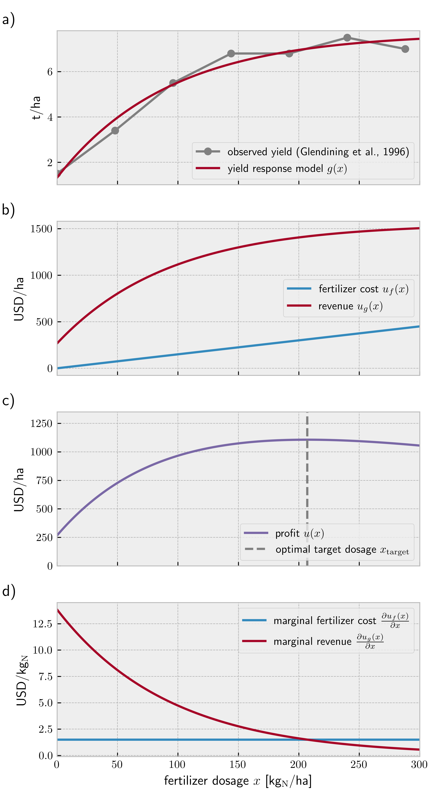
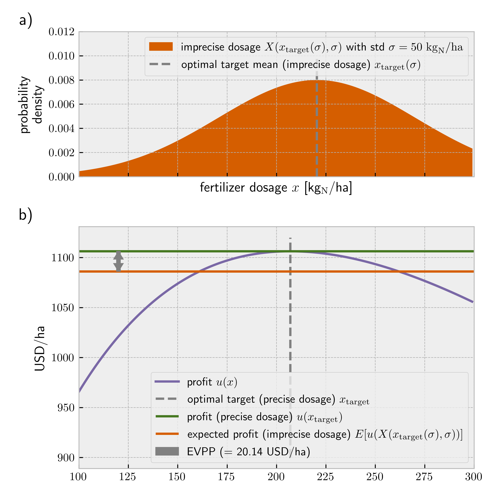

# Full derivation of the VoP formula for *Case Study 1: Linear Costs, Diminishing Marginal Productivity*

We model the relationship between fertilizer dosage $x$ and yield $g(x)$ as an exponential saturation function with 3 parameters $a$, $b$ and $d$:

$$
g(x) = a \cdot e^{-b x} + d
$$

The utility $u(x)$ is the profit, modeled as revenue $u_g(x)$ minus fertilizer costs $u_f(x)$, calculated using the harvest selling price $c_g$ and the fertilizer price $c_f$ (illustrated in Figure 1b and c):

$$
u_g(x) = c_g \cdot g(x) 
$$

$$
u_f(x) = c_f \cdot x
$$

$$
u(x) = u_g(x) - u_f(x)
$$
<figure>
<centering>
</centering>
    <figcaption>Response model for the winter wheat case study. a) Yield response curve fitted to experimental data from the literature. b) Economic revenue from yield and fertilizer costs. c) The resulting economic response curve. d) Marginal costs and marginal gains from increasing fertilizer dosage by 1 kg per ha.</figcaption>
</figure>

The target fertilizer dosage $x_\text{target}$ that maximizes profit is then calculated using the zero of the derivative with respect to $x$, i.e. the fertilizer dosage, where the marginal costs exceed the marginal benefits as shown in Figure 1 d).

$$
x_\text{target} = \text{arg}\max_x u(x) 
$$

$$
\iff \frac{\partial u(x)}{\partial x} \mid_{x = x_\text{target}} = 0
$$

$$
\iff \frac{\partial u_g(x)}{\partial x} \mid_{x = x_\text{target}} = \frac{\partial u_f(x)}{\partial x} \mid_{x = x_\text{target}}
$$

$$
\iff -abc_g \cdot e^{-bx_\text{target}} = c_f
$$

$$
\iff x_\text{target} =  -\dfrac{1}{b} \ln(-\dfrac{c_f}{c_g}\cdot\dfrac{1}{ab})
$$

In the example, we get an optimal dosage target (given perfect precision) of $x_\text{target} = 206.9 \ \text{kg}_\text{N} / \text{ha}$.

Now we assume imprecise dosage as a normally distributed random variable $X \sim \mathcal{N}(\mu, \sigma)$ with mean $\mu$, standard deviation $\sigma$ and probability density function $f_X(x, \mu, \sigma)$. (Note: this neglects the fact, that fertilizer dosage is always positive in reality.) This is illustrated in Figure 2 a) with an exemplary standard deviation of $\sigma = 50  \ \text{kg}_\text{N} / \text{ha}$.

Then the expected utility given this imprecise dosage $E[u(x=X(\mu, \sigma))]$ can be calculated as follows:

$$
E[u(x=X(\mu, \sigma))] = \int_{-\infty}^\infty u(x)\cdot f_X(x, \mu, \sigma) dx 
$$

$$
= \int_{-\infty}^\infty (c_g \cdot (a \cdot e^{-bx} +d) - c_f \cdot x) \frac{1}{\sqrt{2\pi\sigma^2} } e^{-\frac{(x-\mu)^2}{2\sigma^2}} dx
$$

$$
= c_g \cdot a \cdot e^{\frac{b^2 \sigma^2}{2}} e^{-b \mu} + c_g \cdot d - c_f \cdot \mu
$$

The integral was solved using the excellent open source Computer Algebra System *Maxima*.

But $u(x)$ is not symmetrical around $x_\text{target}$, so the optimal mean $x_\text{target}(\sigma)$ of a normal distribution with $\sigma > 0$ is different from $x_\text{target}$ (see Figure 1 a and b).

To calculate this optimal mean, the zero of the derivative of the expected utility is computed:

$$
x_\text{target}(\sigma) = \text{arg}\max_{\mu} E[u(x=X(\mu, \sigma))] 
$$

$$
\iff \frac{\partial E[u(x=X(\mu, \sigma))]}{\partial \mu} \mid_{ \mu = x_\text{target}(\sigma)} = 0 
$$

$$
\iff  c_g \cdot a \cdot b \cdot e^{\frac{b^2 \sigma^2}{2}} e^{-b x_\text{target}(\sigma)} + c_f = 0 
$$

$$
\iff x_\text{target}(\sigma) = \frac{b^2 \sigma^2 - 2 \ln\left(-\frac{c_f}{a b c_g}\right)}{2 b}
$$

So the optimal mean of a normally distributed dosage is here linear to its variance $\sigma^2$. In the example, we get $x_\text{target}(\sigma = 50  \ \text{kg}_\text{N} / \text{ha}) = 220.4  \ \text{kg}_\text{N} / \text{ha}$, which is significantly higher than the optimal target given perfect precision.

The difference between the utility given precise dosage $u(x_\text{target})$ and this expected utility given imprecise dosage is the the expected value of perfect precision (EVPP), as illustrated in Figure 2 b):
  
$$
\text{EVPP} = u(x_\text{target}) - E[u(x=X(x_\text{target}(\sigma), \sigma))] 
$$

$$
= (c_g \cdot (a \cdot e^{-b \cdot -\dfrac{1}{b} \ln(-\dfrac{c_f}{c_g}\cdot\dfrac{1}{ab})} + d) - c_f \cdot -\dfrac{1}{b} \ln(-\dfrac{c_f}{c_g}\cdot\dfrac{1}{ab})) 
$$

$$
= - (- c_g \cdot a \cdot e^{\frac{b^2 \sigma^2}{2}} e^{-b \frac{b^2 \sigma^2 - 2 \ln\left(-\frac{c_f}{a b c_g}\right)}{2 b}} + c_g \cdot d - c_f \cdot \frac{b^2 \sigma^2 - 2 \ln\left(-\frac{c_f}{a b c_g}\right)}{2 b}) 
$$

$$
= \frac{b c_{f} \sigma^{2}}{2}
$$

This expression drastically simplifies, so in the end, the EVPP only depends on the exponential coefficient $b$ in the fertilizer response, the cost of fertilizer $c_f$ and the variance of the fertilization dosage $\sigma^2$, and it does so linearly. Interestingly, the the EVPP does neither depend on the yield given fertilizer saturation ($a$ and $d$) nor on the harvest selling price $c_g$.