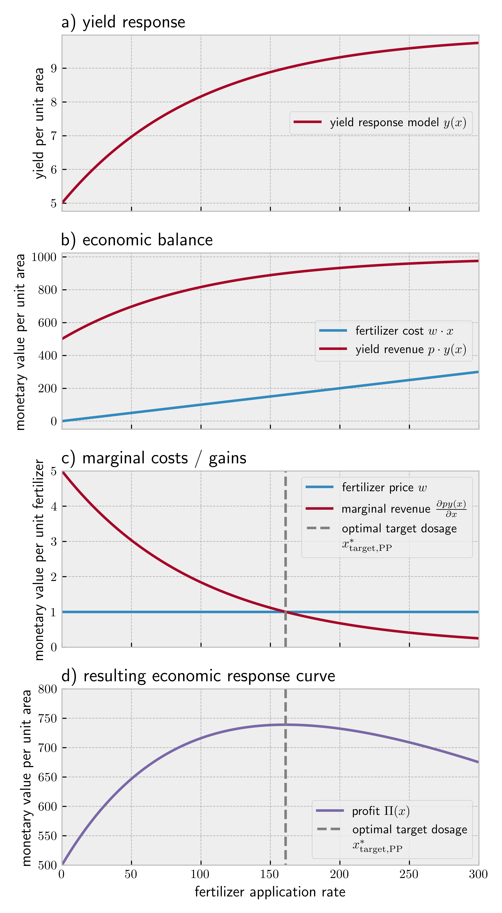

# Full derivation of the VoP formula for *2.3 Illustrative example: Fertilization*

We model the relationship between fertilizer application rate $x$ and yield $y(x)$ as an exponential saturation function with 3 parameters $a$, $b$ and $d$:

$$
y(x) = a \cdot e^{-b x} + d
$$

The objective function $\Pi(x)$ is the profit, modeled as revenue minus fertilizer costs, calculated using the harvest selling price $p$ and the fertilizer price $w$ (illustrated in Figure 1b and c):

$$
\Pi(x) = p\cdot y(x) - w\cdot x
$$

> Response model for the fertilization example (with illustrative numerical values). a) Yield response curve. b) Economic balance: revenue from yield and fertilizer costs. c) The resulting economic response curve. d) Marginal costs and marginal gains from increasing fertilizer application rate by 1 unit.

The target fertilizer application rate $x^\ast_\text{target, PP}$ that maximizes profit (given perfect precision) is then calculated using the zero of the derivative with respect to $x$, i.e. the fertilizer dosage, where the marginal costs exceed the marginal benefits as shown in Figure 1 d).

$$
x^\ast_\text{target, PP} = \text{arg}\max_x \Pi(x) 
$$

$$
\iff \frac{\partial \Pi(x)}{\partial x} \mid_{x = x^\ast_\text{target, PP}} = 0
$$

$$
\iff \frac{\partial py(x)}{\partial x} \mid_{x = x^\ast_\text{target, PP}} = \frac{\partial wx}{\partial x} \mid_{x = x^\ast_\text{target, PP}}
$$

$$
\iff -abp \cdot e^{-bx^\ast_\text{target, PP}} = w
$$

$$
\iff x^\ast_\text{target, PP} =  -\dfrac{1}{b} \ln(-\cdot\dfrac{w}{abp})
$$

> Graphical representation of the calculcations for the fertilization example (with illustrative numerical values). a) Probability distribution for imprecise application. b) The Expected Value of Perfect Precision (EVPP) as the difference between profits given precise and imprecise application.

Now we model the application rate error as a normally distributed random variable $\mathcal{E} \sim \mathcal{N}(\mu, \sigma)$ with mean $\mu=0$, standard deviation $\sigma$, and probability density function $f_\mathcal{E}(\epsilon; \sigma)$. This error term is added to the target rate:

$$
X(x_\text{target}, \sigma) = x_\text{target} + \mathcal{E}(\sigma)
$$

This is illustrated in Figure 2 a with an exemplary standard deviation.

Then the expected profit given this imprecise application rate $E[\Pi(x=X(x_\text{target}, \sigma))]$ can be calculated as follows:

$$
E[u(x=X(x_\text{target}, \sigma))] = \int_{-\infty}^\infty \Pi(x_\text{target} + \epsilon)\cdot f_\mathcal{E}(\epsilon; \sigma) d\epsilon
$$

<!--
$$
= \int_{-\infty}^\infty \left[ p\left(a e^{-b(x_\text{target} + \epsilon)} + d\right) - w(x_\text{target} + \epsilon) \right] \frac{1}{\sigma\sqrt{2\pi}} e^{-\frac{\epsilon^2}{2\sigma^2}} d\epsilon
$$
-->
$$
= \int_{-\infty}^\infty p a e^{-b(x_\text{target} + \epsilon)} f_\mathcal{E} d\epsilon + \int_{-\infty}^\infty p d f_\mathcal{E} d\epsilon - \int_{-\infty}^\infty w(x_\text{target} + \epsilon) f_\mathcal{E} d\epsilon
$$

$$
= p a e^{-b x_\text{target} + \frac{b^2\sigma^2}{2}} + pd - w x_\text{target}
$$

But $\Pi(x)$ is not symmetrical around $x_\text{target}$, so the optimal mean $x^\ast_\text{target}(\sigma)$ of a normal distribution with $\sigma > 0$ is different from $x^\ast_\text{target, PP}$ (see Figure 1 a and b).

To calculate this optimal mean, the zero of the derivative of the expected utility is computed:

$$
x^\ast_\text{target}(\sigma) = \text{arg}\max_{x_\text{target}} E[u(x=X(x_\text{target}, \sigma))] 
$$

$$
\iff \frac{\partial E[u(x=X(x_\text{target}, \sigma))]}{\partial \mu} \mid_{x_\text{target} = x^\ast_\text{target}(\sigma)} = 0 
$$

$$
\iff  p a b e^{\frac{b^2 \sigma^2}{2}} e^{-b x^\ast_\text{target}(\sigma)} + w = 0 
$$

$$
\iff x^\ast_\text{target}(\sigma) = \frac{b^2 \sigma^2 - 2 \ln\left(-\frac{w}{a b p}\right)}{2 b}\\
 = \frac{1}{2}b\sigma^2 - \frac{1}{b} \ln\left(-\frac{w}{a b p}\right)
$$

So the optimal mean of a normally distributed dosage is here linear to its variance $\sigma^2$.

The difference between the utility given precise dosage $\Pi(x^\ast_\text{target, PP})$ and this expected utility given imprecise dosage is the the expected value of perfect precision (EVPP), as illustrated in Figure 2 b):
  
$$
\text{EVPP} = \Pi(x^\ast_\text{target, PP}) - E[\Pi(x=X(x^\ast_\text{target}(\sigma), \sigma))]
$$

$$
= \left(p  (a \cdot e^{-b \cdot -\dfrac{1}{b} \ln\left(-\cdot\dfrac{w}{abp}\right)} + d) - w \cdot -\dfrac{1}{b} \ln\left(-\cdot\dfrac{w}{abp}\right)\right) 
$$

$$
= - \left(- p \cdot a \cdot e^{\frac{b^2 \sigma^2}{2}} e^{-b \frac{b^2 \sigma^2 - 2 \ln\left(-\frac{w}{a b p}\right)}{2 b}} + p \cdot d - w \cdot \frac{b^2 \sigma^2 - 2 \ln\left(-\frac{w}{a b p}\right)}{2 b}\right) 
$$

$$
= \frac{1}{2} b w \sigma^{2}
$$

This expression drastically simplifies, so in the end, the EVPP only depends on the exponential coefficient $b$ in the fertilizer response, the cost of fertilizer $w$ and the variance of the fertilization dosage $\sigma^2$, and it does so linearly. Interestingly, the the EVPP does neither depend on the yield given fertilizer saturation ($a$ and $d$) nor on the harvest selling price $p$.
